                         ***  Frontend ****
## Merhabalar, sayfayı ilk açtığınızda karşınıza giriş sayfası çıkar.
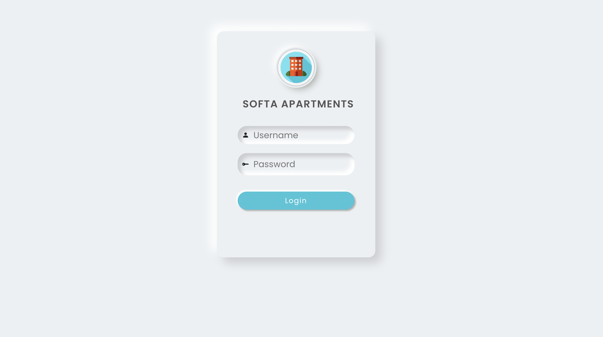
ama şuanlık proje tam bitmediği için diğer sayfaya arama çubuğundan geçiyoruz.
### Arama çubuğuna alttaki urlyi yazarsanız kiracı sayfasına geçer.
```
http://localhost:3000/tenant
```
 #### Üst kısımda kullanıcıya aylık atanan faturalar bulunmaktadır. Altta ise kullanıcının son hareketleri yer almaktadır. Kırmızı ile çizdiğim butona bastığımızda ödeme sayfası karşımıza çıkacaktır.
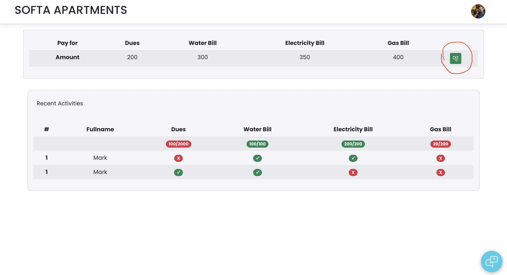
Ödeme sayfası:
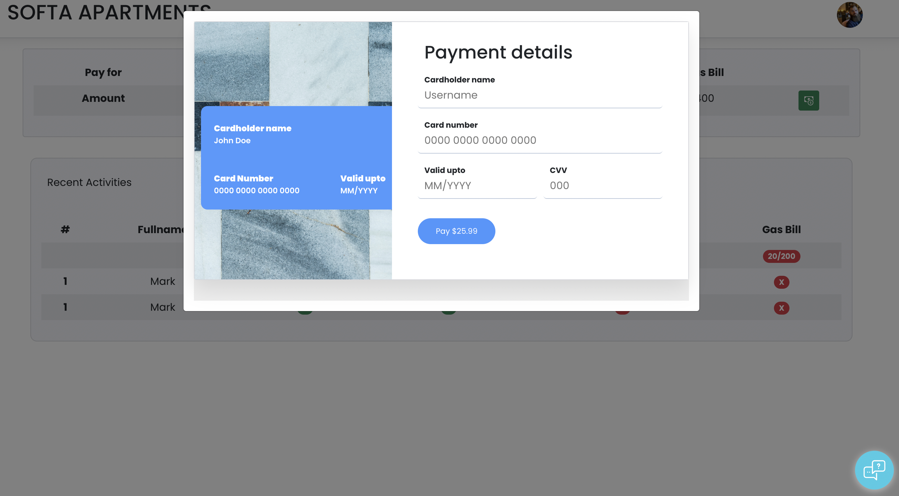
Daire yönetmeni ile kiracının konuştuğu mesaj sekmesi alttaki mavi mesaj iconuna tıklayınca açılıyor:<br><br>
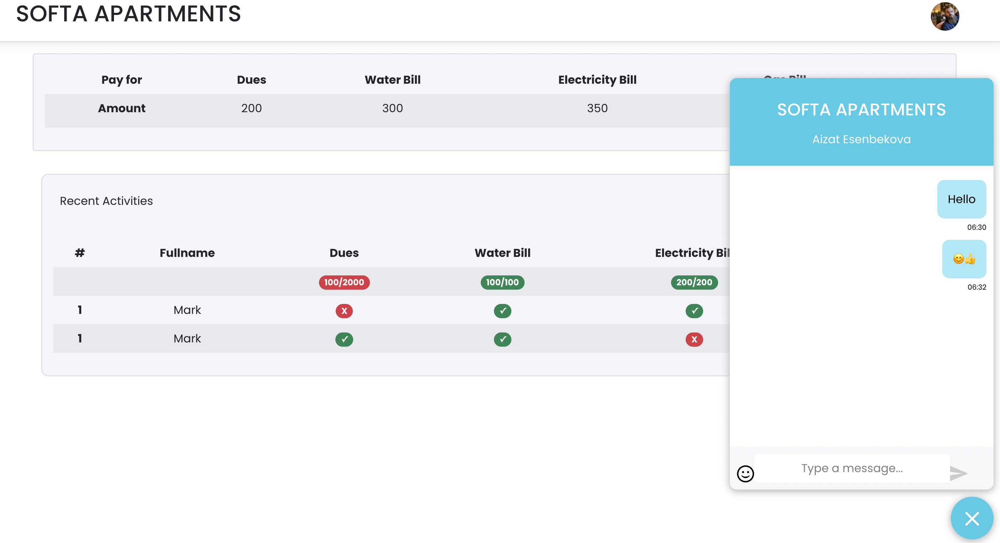

En üst kısımdaki profil fotoğtafına tıklayınca kullanıcı kendisi ile ilgili bazı bilgiler görebilir:
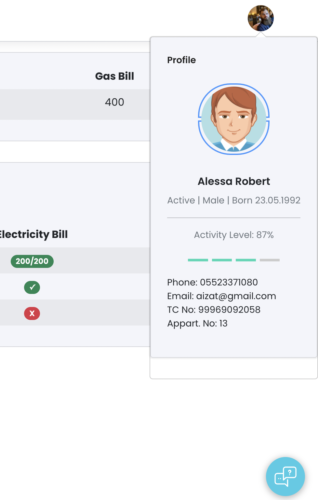
### Url çubuğuna 

```
http://localhost:3000/admin/home
```
yazarak daire yöneticisinin anasayfasına geçiyoruz:
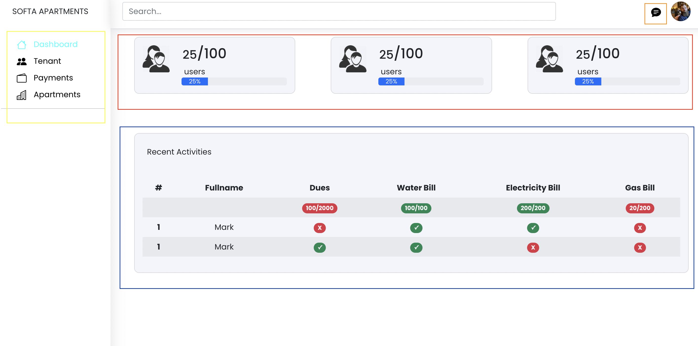
* yeşil ile gösterdiğim kısım menüler
* kırmızı ile gösterdiğim kısım sitedeki kullanıcı sayısı ve doluluk oranı, daire sayısı ve doluluk oranı, aylık ödenmesi gereken toplam para miktarı ve şuanki para miktarı gösterilmiştir
* mavi çizgi ile son hareketler gösterilerek ödenen faturalar kısmına yeşil tık atılmıştır
* en üstteki turuncu kare ile gösterilen mesaj ikonuna tıklayınca karşınıza mesajlaşma sayfası çıkacaktır:<br><br>
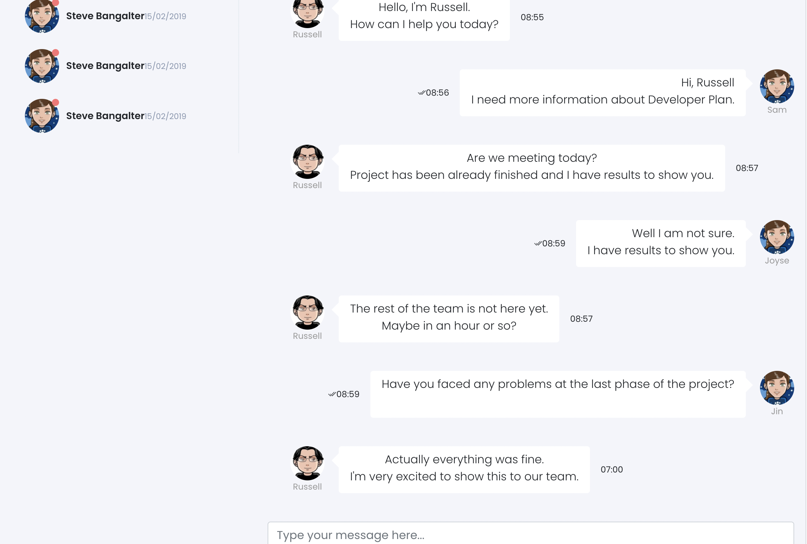
### Menüde <strong>Tenants</strong> butonuna tıklayınca kiracılar ile ilgili bilgi alabileceğimiz sayfaya geçiyoruz.
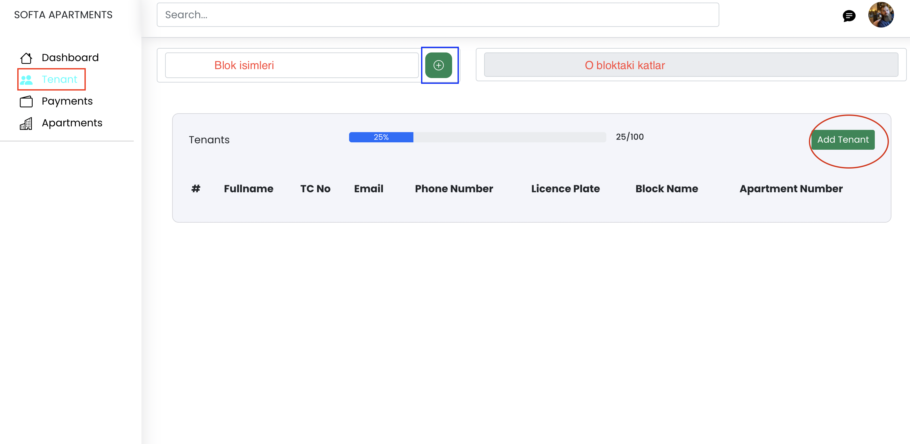
Burada bütün katılımcıların veya blok ve kat sayısına göre filtrelenmiş katılımcıların:
* Ad soyad
* TC kimlik
* Email
* Telefon numara
* Plaka numara
* Kaldığı bloğun adını
* Kaldığı odanın numarsını
görebilirsiniz.
<br> Üstteki mavi kare ile gösterdiğim artı kısmından yeni blok ekleyebilirsiniz.<br><br>
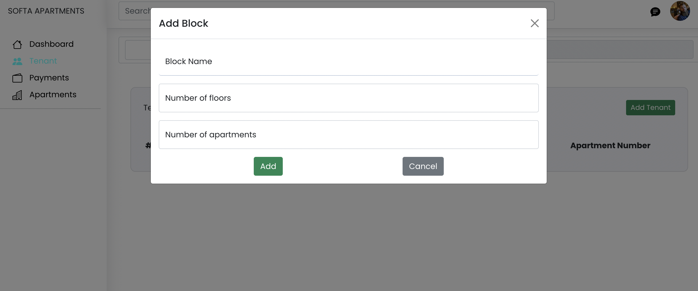
Kırmızı ile gösterdiğim <strong> Add tanent </strong> butonundan yeni katılımcı ekleyebilirsiniz.
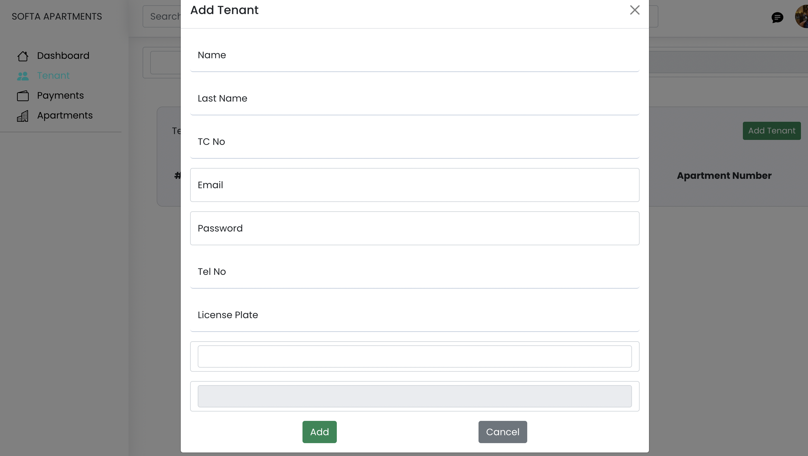
### Menüdeki <strong>Payments</strong> butonu bize ödenmiş ve ödenmemiş faturalar ile ilgili ayrınıtılı bigi verir.
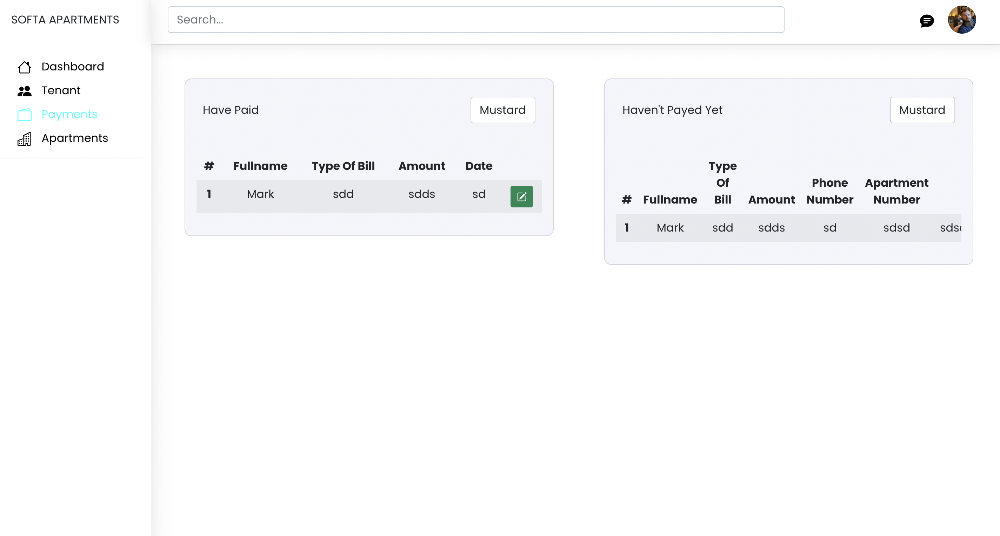

                        *** Backend ****
### Son olarak <strong> Apartman </strong> menüsünde yeni apartman, yen, blok ekleyebilir, bütün ya da blok adı ve kat sayısına göre filtrelenmiş apartman bilgilerini görebilirsiniz
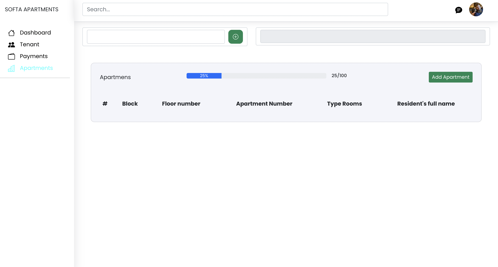
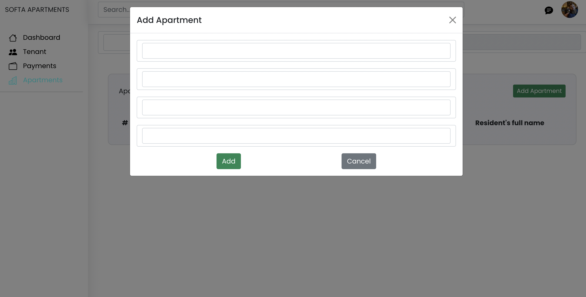

# Getting Started with Create React App

This project was bootstrapped with [Create React App](https://github.com/facebook/create-react-app).

## Available Scripts

In the project directory, you can run:

### `npm start`

Runs the app in the development mode.\
Open [http://localhost:3000](http://localhost:3000) to view it in your browser.

The page will reload when you make changes.\
You may also see any lint errors in the console.

### `npm test`

Launches the test runner in the interactive watch mode.\
See the section about [running tests](https://facebook.github.io/create-react-app/docs/running-tests) for more information.

### `npm run build`

Builds the app for production to the `build` folder.\
It correctly bundles React in production mode and optimizes the build for the best performance.

The build is minified and the filenames include the hashes.\
Your app is ready to be deployed!

See the section about [deployment](https://facebook.github.io/create-react-app/docs/deployment) for more information.

### `npm run eject`

**Note: this is a one-way operation. Once you `eject`, you can't go back!**

If you aren't satisfied with the build tool and configuration choices, you can `eject` at any time. This command will remove the single build dependency from your project.

Instead, it will copy all the configuration files and the transitive dependencies (webpack, Babel, ESLint, etc) right into your project so you have full control over them. All of the commands except `eject` will still work, but they will point to the copied scripts so you can tweak them. At this point you're on your own.

You don't have to ever use `eject`. The curated feature set is suitable for small and middle deployments, and you shouldn't feel obligated to use this feature. However we understand that this tool wouldn't be useful if you couldn't customize it when you are ready for it.

## Learn More

You can learn more in the [Create React App documentation](https://facebook.github.io/create-react-app/docs/getting-started).

To learn React, check out the [React documentation](https://reactjs.org/).

### Code Splitting

This section has moved here: [https://facebook.github.io/create-react-app/docs/code-splitting](https://facebook.github.io/create-react-app/docs/code-splitting)

### Analyzing the Bundle Size

This section has moved here: [https://facebook.github.io/create-react-app/docs/analyzing-the-bundle-size](https://facebook.github.io/create-react-app/docs/analyzing-the-bundle-size)

### Making a Progressive Web App

This section has moved here: [https://facebook.github.io/create-react-app/docs/making-a-progressive-web-app](https://facebook.github.io/create-react-app/docs/making-a-progressive-web-app)

### Advanced Configuration

This section has moved here: [https://facebook.github.io/create-react-app/docs/advanced-configuration](https://facebook.github.io/create-react-app/docs/advanced-configuration)

### Deployment

This section has moved here: [https://facebook.github.io/create-react-app/docs/deployment](https://facebook.github.io/create-react-app/docs/deployment)

### `npm run build` fails to minify

This section has moved here: [https://facebook.github.io/create-react-app/docs/troubleshooting#npm-run-build-fails-to-minify](https://facebook.github.io/create-react-app/docs/troubleshooting#npm-run-build-fails-to-minify)
